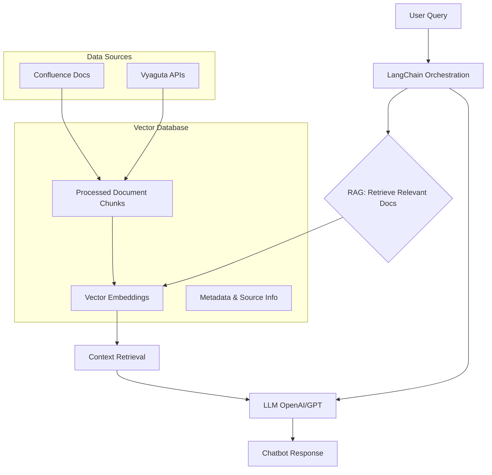
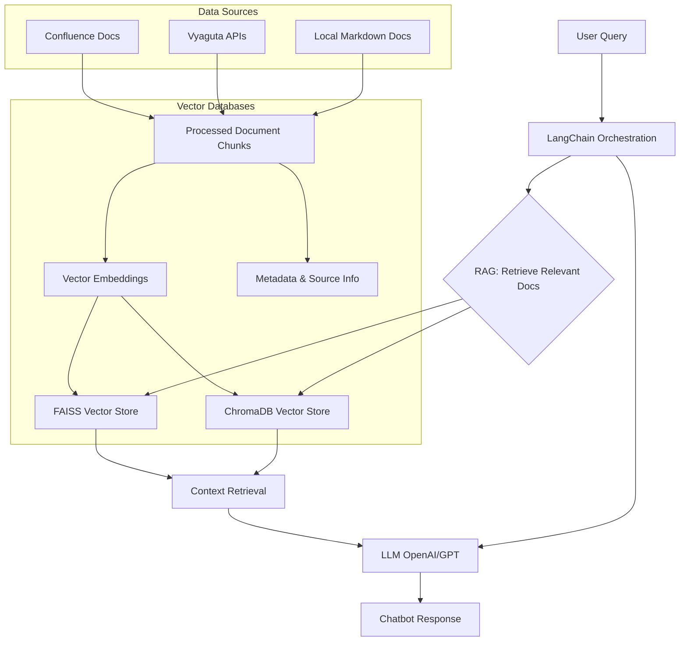

# Vyaguta AI Assistant

Vyaguta AI Assistant is an intelligent chatbot designed to help Leapfrog employees and new joiners quickly find information about Vyaguta’s modules, onboarding, policies, tools, and more. It leverages Retrieval-Augmented Generation (RAG), LangChain, and OpenAI’s LLMs to provide instant, context-aware answers from company documentation and knowledge bases.

## What is Vyaguta AI Assistant?

Vyaguta AI Assistant is your smart companion for all things Vyaguta and Leapfrog. It can:

- Answer questions about Vyaguta modules (OKR, Pulse, Attendance, GAP, etc.)
- Guide you through onboarding, policies, and company processes
- Help you find team contacts, resources, and tools
- Explain coding guidelines and best practices
- Provide instant, reliable answers from internal docs and FAQs

## How does it work? (Workflow Overview)

Vyaguta AI Assistant follows a Retrieval-Augmented Generation (RAG) workflow, combining company knowledge with advanced language models to deliver accurate, context-aware answers. Here’s how the system works:

### 1. Data Sources

- **Local Documents:** Markdown files in the `docs/` directory (policies, onboarding, guidelines, etc.)
- **Vyaguta API:** Live employee and people data fetched from Vyaguta’s internal API
- **(Optional) Confluence:** Company wiki pages (integration available, see guides)

### 2. Document Processing & Embeddings

- Documents are loaded and split into chunks using markdown header-based splitting for fine-grained retrieval
- Each chunk is embedded using OpenAI Embeddings (Ada-002)
- All embeddings are stored in a FAISS vector database/ chromaDB for fast similarity search

### 3. Retrieval-Augmented Generation (RAG)

- When a user asks a question, the system retrieves the most relevant document chunks using semantic search
- A hybrid retriever with contextual compression ensures only the most relevant information is passed to the LLM

### 4. Large Language Model (LLM)

- The retrieved context is sent to an OpenAI LLM (e.g., GPT-4.1-nano)
- A custom prompt template ensures answers are tailored to Vyaguta and Leapfrog

### 5. Answer Delivery

- The LLM generates a helpful, context-aware answer
- The answer is displayed in a modern chat UI (Streamlit), with features like quick questions, reactions, and chat export

#### Visual Workflow

For a detailed technical breakdown and architecture, see `/guides/workflow-explanation.md`.

## Tech Stack

- **LLMs:** OpenAI’s GPT models for natural language understanding and generation
- **RAG:** Retrieval-Augmented Generation for context-aware answers
- **LangChain:** For managing the workflow and integrating components
- **OpenAI:** For semantic search and document retrieval
- **Data Storage:** FAISS vector database/ chromaDB for fast similarity search
- **Frontend:** Streamlit for modern, interactive UI
- **Backend:** LangChain for orchestration, OpenAI for LLMs

---

For setup, usage, and advanced guides, see the `/guides/` folder in this repository.
