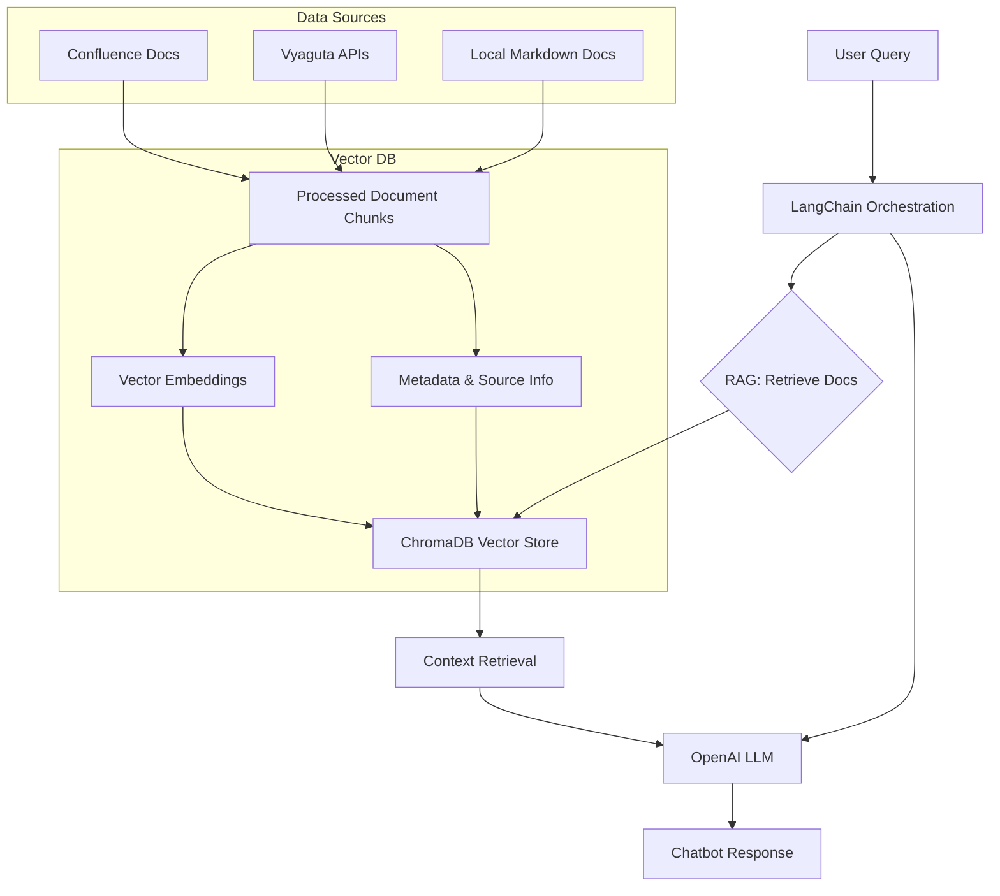

# Vyaguta Assistant Project Presentation

---

## 1. Welcome Page

**Vyaguta AI Assistant**

_Empowering Leapfrog with Instant, Context-Aware Answers_

---

## 2. Introduction

### Problem Statement

Vyaguta and Leapfrog's internal processes are broad and complex. Employees—whether new or experienced—often struggle to find clear, up-to-date answers to their questions about Vyaguta modules, policies, or general Leapfrog procedures. This leads to wasted time, confusion, and frequent support requests across all teams—not just for onboarding, but for anyone needing help.

### Solution

An AI-powered chatbot that instantly answers Vyaguta-related questions using company docs and APIs, reducing onboarding time and support load.

---

## 3. High Level Architecture Diagram



_See `/README.md` and `/guides/workflow-explanation.md` for more diagrams._

---

## 4. Tech Stacks

### Core Libraries & Frameworks

- **Python 3**: Main programming language
- **Streamlit**: Interactive web UI for the chatbot (`chatbot_gui.py`)
- **LangChain**: Orchestrates RAG workflow, prompt templates, and document loaders
- **OpenAI**: Embeddings and LLM (GPT-4.1-nano) for semantic search and answer generation
- **ChromaDB**: Vector database for storing and retrieving document embeddings
- **dotenv**: Loads environment variables
- **requests**: API calls (Vyaguta, Confluence)
- **markdownify, markdown, unstructured**: Markdown and document processing
- **nltk**: Text processing utilities
- **colorama**: Terminal output formatting
- **watchdog**: File system monitoring (for auto-reload)

### Data Sources

- **Local Markdown Docs**: `/docs/` (policies, onboarding, guidelines)
- **Vyaguta API**: Real-time people and org data (`people.py`, `fetch_and_store_people_data.py`)
- **Confluence Docs**: Company wiki (via `confluence_fetch.py`)

### Project Structure & Tooling

- **requirements.txt**: Dependency management
- **Mermaid**: Diagrams in markdown docs
- **Git**: Version control

---

## 5. Challenges and Issues Faced

- **Integration Gaps:** Initial Confluence integration was a separate script, not part of the main RAG pipeline. Solution: Roadmap to integrate Confluence loader directly into the main workflow.
- **Vector Store Persistence:** Started with in-memory FAISS; need for persistent storage led to planned migration to PostgreSQL with pgvector.
- **Automated Data Sync:** Manual refresh required for data sources; solution is to implement scheduled background synchronization.
- **Metadata & Source Tracking:** Early versions lacked rich metadata for document chunks; roadmap includes comprehensive metadata for better filtering and traceability.
- **People API Data Limitations:** While the Vyaguta people API provides a lot of data, it often lacks the depth or context needed to fully answer user queries—especially for nuanced or detailed people-related questions. This can result in incomplete or less helpful responses when users ask about colleagues or organizational structure.

---

## 6. Self Reflection

- Gained hands-on experience with RAG, LangChain, and OpenAI APIs.
- Learned to design scalable data pipelines and integrate multiple data sources.
- Improved skills in prompt engineering and semantic search.
- Understood the importance of robust metadata and persistent storage for enterprise AI solutions.
- Developed practical knowledge in workflow orchestration and system monitoring.

---

## 7. Demo

- **Run the Chatbot:**
  ```bash
  python main.py
  ```
- **Rebuild the RAG Index:**
  ```bash
  python rebuild_rag_pipeline.py
  ```
- **Inspect Vector Store:**
  ```bash
  python inspect_chromadb.py
  ```
- **Streamlit UI:**
  ```bash
  streamlit run chatbot_gui.py
  ```

---

## 8. Future Enhancements

- **Integrate Confluence Loader** directly into the RAG pipeline for seamless doc updates (currently a manual step)
- **Persistent Vector Store**: Migrate from ChromaDB/FAISS to PostgreSQL + pgvector for enterprise-grade storage
- **Automated Data Sync**: Add background jobs for scheduled Confluence and API sync (see `sync_scheduler.py` in roadmap)
- **Expand API Integration**: Fetch system status, permissions, and announcements from Vyaguta APIs
- **Metadata & Source Tracking**: Add richer metadata for all document chunks for better filtering and traceability
- **Monitoring & Health Checks**: Implement vector DB health checks and retrieval performance logging
- **Enhanced Query Routing**: Add query classification and smart routing before RAG (see TODOs in `workflow-explanation.md`)
- **User Feedback Loop**: Collect user feedback on answers to improve retrieval and prompt quality
- **Chain of Thought**: Implement advanced reasoning capabilities for complex queries
- **Integrate with Vyaguta**: Implement the model into the Vyaguta platform for direct access to the chatbot

---

## 9. Thank You

_Questions?_

---

_For more details, see the project documentation and guides in the `/guides/` folder._
