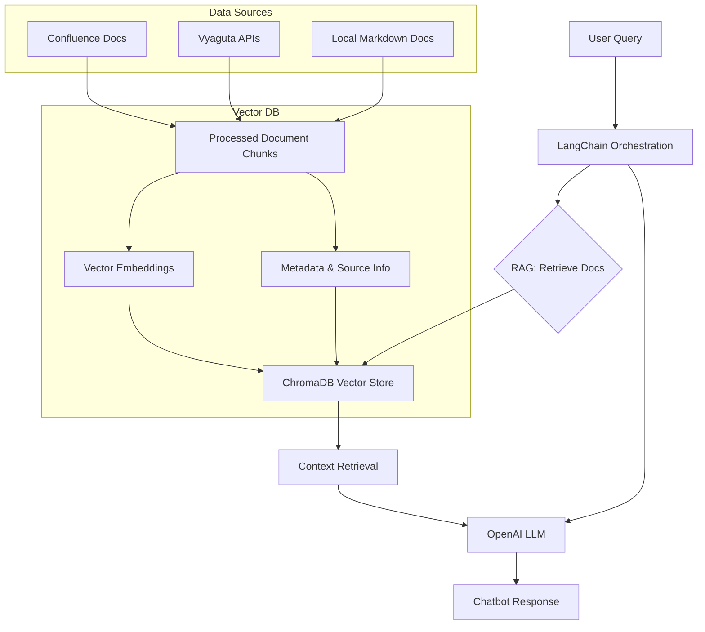

# Vyaguta Assistant Project: Deep Dive & Interview Q&A

---

## 1. Project Overview

Vyaguta Assistant is an AI-powered chatbot designed to provide instant, context-aware answers to questions about Vyaguta modules, Leapfrog policies, and general company procedures. It leverages Retrieval-Augmented Generation (RAG) to combine company documentation and APIs with advanced language models, reducing onboarding time and support load for all employees.

---

## 2. Detailed Explanation of Each Component

### Problem Statement

- **Challenge:** Employees struggle to find up-to-date, clear answers about Vyaguta and Leapfrog processes, leading to wasted time and frequent support requests.
- **Goal:** Build a system that provides instant, reliable answers using all available company knowledge sources.

### Solution

- **AI Chatbot:** Uses RAG to combine document retrieval with LLMs, ensuring answers are both accurate and contextually relevant.

### High Level Architecture

- **LangChain Orchestration:** Manages the workflow between user queries, document retrieval, and LLM response generation.
- **RAG (Retrieval-Augmented Generation):** Retrieves relevant document chunks from various sources and feeds them to the LLM for answer generation.
- **Data Sources:**
  - **Confluence Docs:** Company wiki, fetched and indexed for search.
  - **Vyaguta APIs:** Real-time people/org data.
  - **Local Markdown Docs:** Policies, onboarding, guidelines.
- **Vector DB (ChromaDB):** Stores document embeddings and metadata for fast semantic search.
- **OpenAI LLM:** Generates answers using retrieved context.

### Core Libraries & Frameworks

- **Python 3:** Chosen for its rich ecosystem and AI/ML support.
- **Streamlit:** Provides a simple, interactive web UI for the chatbot.
- **LangChain:** Orchestrates the RAG workflow, prompt templates, and document loaders. Chosen for its modularity and support for multiple data sources.
- **OpenAI (GPT-4.1-nano):** Used for both embeddings and answer generation. Chosen for its state-of-the-art language understanding.
- **ChromaDB:** Vector database for storing and retrieving document embeddings. Chosen for its speed and ease of use.
- **dotenv:** Loads environment variables securely.
- **requests:** Handles API calls to Vyaguta and Confluence.
- **markdownify, markdown, unstructured:** Used for processing and cleaning markdown and other document formats.
- **nltk:** Provides text processing utilities (e.g., tokenization, stopword removal).
- **colorama:** Adds color to terminal output for better UX.
- **watchdog:** Monitors file system for changes, enabling auto-reload of data.

### Data Sources

- **Local Markdown Docs:** `/docs/` folder contains policies, onboarding guides, and coding guidelines.
- **Vyaguta API:** Real-time data about people and org structure, fetched and indexed for search.
- **Confluence Docs:** Company wiki, fetched via a dedicated script and indexed for retrieval.

### Project Structure & Tooling

- **requirements.txt:** Manages Python dependencies.
- **Mermaid:** Used for architecture diagrams in markdown docs.
- **Git:** Version control for code and documentation.

### Challenges and Solutions

- **Integration Gaps:** Initially, Confluence integration was separate. Plan to integrate it directly into the RAG pipeline for seamless updates.
- **Vector Store Persistence:** Started with in-memory FAISS; migrated to ChromaDB for persistence. Future plan: PostgreSQL + pgvector for enterprise-grade storage.
- **Automated Data Sync:** Manual refresh was required; roadmap includes scheduled background sync jobs.
- **Metadata & Source Tracking:** Early versions lacked rich metadata. Now, document chunks include comprehensive metadata for better filtering and traceability.
- **People API Data Limitations:** API sometimes lacks depth/context for people queries. Solution: Combine API data with documentation and improve prompt engineering.

### Self Reflection

- Gained hands-on experience with RAG, LangChain, and OpenAI APIs.
- Learned to design scalable data pipelines and integrate multiple data sources.
- Improved prompt engineering and semantic search skills.
- Understood the importance of robust metadata and persistent storage.
- Developed practical knowledge in workflow orchestration and system monitoring.

### Demo & Usage

- **Run the Chatbot:** `python main.py`
- **Rebuild the RAG Index:** `python rebuild_rag_pipeline.py`
- **Inspect Vector Store:** `python inspect_chromadb.py`
- **Streamlit UI:** `streamlit run chatbot_gui.py`

### Future Enhancements

- Integrate Confluence loader directly into RAG pipeline.
- Migrate vector store to PostgreSQL + pgvector.
- Add background jobs for automated data sync.
- Expand API integration for more real-time data.
- Add richer metadata for all document chunks.
- Implement health checks and performance logging.
- Add query classification and smart routing.
- Collect user feedback to improve answer quality.

---

## 3. Interview Questions & Answers

### General Project

**Q: What is the Vyaguta Assistant and why did you build it?**
A: Vyaguta Assistant is an AI-powered chatbot that provides instant, context-aware answers about Vyaguta modules, Leapfrog policies, and company procedures. It was built to reduce onboarding time, minimize support requests, and empower employees with self-service access to company knowledge.

**Q: Why did you choose RAG (Retrieval-Augmented Generation) over a pure LLM approach?**
A: RAG ensures that answers are grounded in company-specific documentation and data, reducing hallucinations and increasing accuracy. Pure LLMs may generate plausible but incorrect answers if not provided with up-to-date context.

### Technical Choices

**Q: Why use LangChain?**
A: LangChain provides modular tools for chaining together document loaders, retrievers, and LLMs. It supports multiple data sources and makes it easy to orchestrate complex RAG workflows.

**Q: Why ChromaDB for the vector store?**
A: ChromaDB is fast, easy to use, and supports persistent storage. It was a better fit than in-memory FAISS for our needs. For enterprise scale, we plan to migrate to PostgreSQL + pgvector.

**Q: Why OpenAI's GPT-4.1-nano?**
A: It offers state-of-the-art language understanding and generation, with good performance and cost balance for our use case.

**Q: Why Streamlit for the UI?**
A: Streamlit allows rapid development of interactive web apps in Python, making it easy to build and iterate on the chatbot interface.

**Q: How do you ensure the chatbot gives accurate answers?**
A: By using RAG, the chatbot retrieves relevant document chunks and provides them as context to the LLM. Prompt engineering further guides the LLM to quote or summarize from the context, not invent answers.

**Q: How do you handle incomplete or missing data?**
A: The prompt instructs the LLM to politely say "I'm not sure" if the answer is not in the context. If the user repeats the question, the assistant suggests official resources for further help.

### Challenges & Solutions

**Q: What was the biggest technical challenge?**
A: Integrating multiple data sources (APIs, markdown, Confluence) and ensuring the vector store is always up-to-date and persistent. Also, prompt engineering to handle nuanced people queries was challenging.

**Q: How did you address the limitations of the People API?**
A: By combining API data with documentation and using prompt engineering to set clear answer formats and fallback behaviors.

**Q: How do you plan to improve the system in the future?**
A: By integrating Confluence directly into the RAG pipeline, migrating to PostgreSQL + pgvector, automating data sync, and adding more real-time API integrations.

### Design Decisions

**Q: Why not use only the Vyaguta API or only documentation?**
A: Each source has strengths and weaknesses. The API provides real-time data, but lacks depth. Documentation is rich but can be outdated. Combining both ensures the best coverage and accuracy.

**Q: Why not use a database like Elasticsearch for retrieval?**
A: ChromaDB is optimized for vector search and integrates easily with LangChain. For future scalability, we plan to use PostgreSQL + pgvector, which offers both vector and relational capabilities.

### Prompt Engineering

**Q: How did you design the prompt template?**
A: The prompt is carefully crafted to instruct the LLM to quote or summarize from the context, handle people queries with specific formats, and provide fallback instructions for missing data or repeated uncertainty.

**Q: How do you handle special cases, like queries about the chatbot creator?**
A: The prompt includes explicit instructions for such cases, ensuring the LLM always gives the correct, pre-approved answer.

---

## 4. Tips for Interview/Presentation

- Be ready to explain why each technology was chosen (tradeoffs, alternatives considered).
- Emphasize the importance of combining multiple data sources for accuracy.
- Highlight how prompt engineering and RAG reduce hallucinations.
- Discuss future plans and how the architecture supports scalability and maintainability.
- Use the demo commands to show practical usage.
- Be honest about challenges and how you addressed them.

---

## 5. Detailed Workflow Explanation (with Examples)

### Visual Workflow Diagram

### Step-by-Step Technical Explanation

#### 1. User Query (A)

- **What happens:**
  - The user types a question, e.g., "How do I apply for leave in Vyaguta?" or "Who is Purna?"
- **Example:**
  - "What is the process for reimbursement?"

#### 2. LangChain Orchestration (B)

- **What happens:**
  - LangChain acts as the central controller. It receives the user query and decides how to process it.
  - It manages the flow between retrieval (RAG) and the LLM.
- **Technical:**
  - LangChain chains together retrievers, prompt templates, and LLMs.
- **Non-technical analogy:**
  - Like a smart receptionist who knows which department to ask for the answer.

#### 3. RAG: Retrieve Docs (C)

- **What happens:**
  - RAG (Retrieval-Augmented Generation) means the system first looks up relevant documents before generating an answer.
  - It does not rely only on the LLM's memory, but grounds answers in real company data.
- **Technical:**
  - The query is embedded and compared to all document vectors for similarity.
- **Non-technical analogy:**
  - Like searching a digital library for the most relevant book chapters before answering.

#### 4. Data Sources (D, E, F)

- **What happens:**
  - The system can pull from:
    - **Confluence Docs:** Company wiki pages (policies, guides)
    - **Vyaguta APIs:** Real-time employee/org data
    - **Local Markdown Docs:** Internal documentation
- **Example:**
  - For "leave policy", it may find a section in `holiday-leave.md` and a Confluence page.

#### 5. Processed Document Chunks (G)

- **What happens:**
  - All documents are split into small, meaningful chunks (e.g., a paragraph, a list, or a Q&A section).
- **Technical:**
  - Chunking is done using text splitters for better retrieval granularity.
- **Non-technical analogy:**
  - Like cutting a book into index cards, each with a single topic.

#### 6. Vector Embeddings (H)

- **What happens:**
  - Each chunk is converted into a high-dimensional vector (embedding) using OpenAI's embedding model.
- **Technical:**
  - Embeddings capture the semantic meaning of text, enabling similarity search.
- **Non-technical analogy:**
  - Like turning each card into a unique fingerprint for fast matching.

#### 7. Metadata & Source Info (I)

- **What happens:**
  - Each chunk is tagged with metadata: source file, section, date, etc.
- **Technical:**
  - Metadata enables filtering, traceability, and transparency in answers.
- **Non-technical analogy:**
  - Like writing the book title and page number on each index card.

#### 8. ChromaDB Vector Store (J)

- **What happens:**
  - All embeddings and metadata are stored in ChromaDB, a fast, persistent vector database.
- **Technical:**
  - ChromaDB enables efficient similarity search across all chunks.
- **Non-technical analogy:**
  - Like a digital card catalog that can instantly find the most similar cards to your question.

#### 9. Context Retrieval (K)

- **What happens:**
  - The system retrieves the top-k most relevant chunks for the user query.
- **Technical:**
  - Uses vector similarity (cosine distance) to rank chunks.
- **Example:**
  - For "promotion policy 2025", only the chunks about 2025 promotions are retrieved.

#### 10. OpenAI LLM (L)

- **What happens:**
  - The retrieved context and the user query are sent to the LLM (GPT-4.1-nano).
  - The LLM is guided by a custom prompt to answer using only the provided context.
- **Technical:**
  - Prompt engineering ensures the LLM quotes or summarizes from the docs, not from its own memory.
- **Non-technical analogy:**
  - Like a smart assistant who reads the relevant index cards and summarizes them for you.
- **Example:**
  - For "Who is Purna?", the LLM uses the exact format and data from the people API/doc.

#### 11. Chatbot Response (M)

- **What happens:**
  - The answer is shown to the user, often with source info and, if needed, the most relevant doc section.
- **Technical:**
  - The system can also show which sources were used, and fallback to LLM general knowledge if no context is found.
- **Non-technical analogy:**
  - Like a librarian telling you the answer and showing you the book it came from.
- **Example:**
  - "You can apply for leave by... (from holiday-leave.md)"

---

### Real-World, Non-Technical Analogies for the Workflow

#### 1. User Query (A)

- **Analogy:** Like a person walking up to a help desk and asking a question, e.g., "How do I get a new ID card?"

#### 2. LangChain Orchestration (B)

- **Analogy:** The help desk agent listens to your question and decides which department or expert to consult for the answer.

#### 3. RAG: Retrieve Docs (C)

- **Analogy:** Instead of guessing, the agent goes to the company’s official manuals, handbooks, and records to look up the answer.

#### 4. Data Sources (D, E, F)

- **Analogy:** The agent checks:
  - The company’s official handbook (local docs)
  - The HR department’s records (API)
  - The company’s internal wiki (Confluence)

#### 5. Processed Document Chunks (G)

- **Analogy:** The agent doesn’t read the whole handbook, but looks at the relevant page or paragraph that answers your question.

#### 6. Vector Embeddings (H)

- **Analogy:** The agent uses a smart highlighter to mark the most relevant sentences or paragraphs, making it easy to find the best match for your question.

#### 7. Metadata & Source Info (I)

- **Analogy:** The agent notes down where the information came from (e.g., "Page 12 of the Employee Handbook, updated March 2025").

#### 8. ChromaDB Vector Store (J)

- **Analogy:** All these highlighted, tagged snippets are stored in a super-organized digital filing cabinet, so the agent can instantly find the right info for any question.

#### 9. Context Retrieval (K)

- **Analogy:** The agent pulls out the most relevant pages or notes from the filing cabinet to answer your question.

#### 10. OpenAI LLM (L)

- **Analogy:** The agent reads the relevant notes and explains the answer to you in plain language, making sure to use only what’s in the official documents.

#### 11. Chatbot Response (M)

- **Analogy:** The agent tells you the answer, and if you want, shows you the exact page or note where the answer came from.

---

### Real-World Example Scenarios

#### Example 1: "How do I get a new ID card?"

- **Workflow:**
  1. You ask the help desk (user query)
  2. The agent (LangChain) checks the employee handbook, HR records, and wiki
  3. Finds the exact paragraph in the handbook about ID cards
  4. Reads it and explains: "You need to fill out Form X and visit the HR desk. Here’s the official process from the handbook."

#### Example 2: "Who is the head of HR?"

- **Workflow:**
  1. You ask the help desk
  2. The agent checks the latest HR records and the company wiki
  3. Finds the official listing for the HR head
  4. Replies: "The head of HR is Jane Doe. You can contact her at jane@company.com."

#### Example 3: "What’s the company mascot?" (Unknown)

- **Workflow:**
  1. You ask the help desk
  2. The agent checks all official sources but finds nothing
  3. Replies: "I’m not sure based on the current information. You may want to check with the communications team."

---

## 6. Deep Dive: Codebase Components, Techniques, and Best Practices

### 1. Document Chunking & Text Splitters
- **Purpose:**
  - Large documents are split into smaller, meaningful pieces ("chunks") to improve retrieval accuracy and LLM context usage.
- **How it works:**
  - The code uses `RecursiveCharacterTextSplitter` (from LangChain) to break markdown files into chunks of a set size (e.g., 1000 characters) with overlap (e.g., 200 characters).
  - Overlap ensures that important context at chunk boundaries is not lost.
- **Why:**
  - LLMs have a context window limit. Chunking ensures only the most relevant, manageable pieces are retrieved and passed to the LLM.
- **Example:**
  - A 10-page policy is split into 20 chunks, each representing a section or paragraph, so the system can retrieve just the part about "leave approval" if asked.

### 2. Embeddings & Vector Search
- **Purpose:**
  - Convert text chunks into high-dimensional vectors (embeddings) that capture semantic meaning.
- **How it works:**
  - Uses OpenAI's Ada-002 embedding model to turn each chunk into a vector.
  - All vectors are stored in ChromaDB, a vector database.
  - When a user asks a question, it is also embedded and compared to all chunk vectors using cosine similarity.
- **Why:**
  - Enables semantic search: "What is the leave process?" will match the right chunk even if the wording is different.
- **Example:**
  - "How do I get reimbursed?" matches a chunk about "expense claims" even if the word "reimburse" isn't used.

### 3. Retriever & Top-k Selection
- **Purpose:**
  - Find the most relevant chunks for a given query.
- **How it works:**
  - The retriever queries ChromaDB for the top-k (e.g., 10) most similar chunks to the query embedding.
  - These are passed to the LLM as context.
- **Why:**
  - Reduces noise and ensures the LLM only sees the most relevant information.
- **Example:**
  - For "promotion policy 2025", only the chunks about 2025 promotions are retrieved.

### 4. Metadata & Source Tracking
- **Purpose:**
  - Every chunk is tagged with metadata: source file, section, date, etc.
- **How it works:**
  - Metadata is stored alongside each chunk in ChromaDB.
  - Used for filtering, debugging, and showing sources in answers.
- **Why:**
  - Increases transparency and trust in answers.
- **Example:**
  - "[Source: holiday-leave.md]" is shown with the answer.

### 5. Prompt Engineering & Techniques
- **Purpose:**
  - Guide the LLM to answer using only the provided context, in a specific format, and to handle special cases.
- **How it works:**
  - Uses a custom prompt template (see `main.py`), with detailed instructions:
    - Always quote or summarize from the context.
    - Use a specific format for people queries (e.g., "Who is Purna?").
    - If unsure, say "I'm not sure" and suggest official resources if asked again.
    - For promotion-year queries, explain which quarters are covered.
    - For creator queries, always use a hardcoded answer.
- **Prompting style:**
  - This is a form of "instruction prompting" (not chain-of-thought), where the LLM is told exactly how to behave.
  - The prompt is long and covers many edge cases to reduce hallucination.
- **Why:**
  - Ensures consistency, accuracy, and compliance with company policy.
- **Example:**
  - For "Who is Purna?", the LLM always gives the exact, pre-approved answer.

### 6. Chain of Thought (CoT) Reasoning
- **Is it used?**
  - Not explicitly. The system uses instruction prompting, not CoT prompting.
  - However, the LLM may use step-by-step reasoning internally if the prompt asks for a list or process.
- **How to add CoT:**
  - You could add "Think step by step" to the prompt for more complex reasoning, but for this use case, direct instruction is preferred.

### 7. LangChain Orchestration
- **Purpose:**
  - Manages the workflow: user query → retriever → prompt → LLM → answer.
- **How it works:**
  - Chains together the retriever, prompt template, and LLM in a `RetrievalQA` chain.
- **Why:**
  - Modular, easy to extend, and supports multiple data sources.
- **Example:**
  - You can swap out ChromaDB for another vector store, or add new data sources, with minimal code changes.

### 8. Fallbacks & General Knowledge
- **Purpose:**
  - If no relevant context is found, the system can:
    - Show the most relevant chunk (even if not a perfect match)
    - Use the LLM's general knowledge (with a strict prompt to avoid hallucination)
    - Always show the source or say "I'm not sure"
- **How it works:**
  - Controlled in `main.py` after the QA chain runs.
- **Why:**
  - Ensures the user always gets a helpful, honest answer.

### 9. Automation & Index Management
- **Purpose:**
  - Keep the knowledge base up to date and the chatbot fast.
- **How it works:**
  - `rebuild_rag_pipeline.py` rebuilds the ChromaDB index and pickled docs when docs change.
  - `main.py` loads the existing index for fast startup.
  - `inspect_chromadb.py` lets you audit the vector store.
- **Why:**
  - Avoids slow startup and unnecessary recomputation.

### 10. Streamlit UI
- **Purpose:**
  - Provides a modern, interactive web interface for the chatbot.
- **How it works:**
  - `chatbot_gui.py` uses Streamlit to create a chat-like experience, with features like quick questions, reactions, and chat export.
- **Why:**
  - Makes the assistant accessible to all employees, not just technical users.

### 11. API Integration & Data Sync
- **Purpose:**
  - Fetches real-time people/org data from Vyaguta APIs.
- **How it works:**
  - `people.py` and `fetch_and_store_people_data.py` fetch and process API data.
  - Confluence docs are fetched via `confluence_fetch.py` (manual or scheduled).
- **Why:**
  - Ensures the assistant always has the latest information.

### 12. Best Practices & Interview Tips
- **Explain why each technique is used:**
  - Chunking: for retrieval granularity and LLM context limits
  - Embeddings: for semantic search
  - Metadata: for transparency and filtering
  - Prompt engineering: for accuracy and compliance
  - LangChain: for modular, maintainable workflow
- **Be ready to discuss tradeoffs:**
  - Chunk size vs. retrieval accuracy
  - Persistent vector store (ChromaDB) vs. in-memory (FAISS)
  - Instruction prompting vs. chain-of-thought
- **Show you understand the full pipeline:**
  - From document loading, chunking, embedding, storage, retrieval, prompting, LLM, to answer delivery
- **Mention future improvements:**
  - Automated sync, more real-time APIs, query classification, health checks, user feedback loop

---

This section gives you a deep, technical understanding of every part of the codebase and the reasoning behind each design choice. Use it to confidently answer any technical or architectural question in your interview or presentation!

---

## 7. Codebase Structure, Tooling, and Critical Analysis

### A. Codebase Structure: What Each File/Module Does

| File/Module                      | Purpose & Usage                                                                                 |
|----------------------------------|-----------------------------------------------------------------------------------------------|
| `main.py`                        | Entry point for the chatbot (CLI). Orchestrates RAG pipeline, prompt logic, and answer flow.   |
| `chatbot_gui.py`                 | Streamlit-based web UI for the chatbot.                                                        |
| `rag_pipeline.py`                | Core RAG logic: document loading, chunking, embedding, vector store management.                |
| `rebuild_rag_pipeline.py`        | Script to rebuild the vector index and pickled docs when sources change.                       |
| `inspect_chromadb.py`            | Utility to inspect and debug the ChromaDB vector store.                                        |
| `people.py`                      | Fetches and processes people/org data from Vyaguta API.                                        |
| `fetch_and_store_people_data.py` | Script to fetch and store people/org data for indexing.                                        |
| `confluence_fetch.py`            | Fetches Confluence docs for local indexing.                                                    |
| `log_utils.py`                   | Logging utilities for consistent, colored terminal output.                                     |
| `config.py`                      | Centralized configuration (paths, API keys, settings).                                         |
| `auth.py`                        | Handles authentication for APIs (Vyaguta, Confluence).                                         |
| `docs_consolidated.pkl`          | Pickled, pre-processed docs for fast loading.                                                  |
| `requirements.txt`/`pyproject.toml` | Dependency management.                                                                      |
| `streamlit.css`                  | Custom CSS for Streamlit UI.                                                                  |
| `assets/`                        | Icons and images for UI.                                                                      |
| `docs/`, `docs-api/`, `docs-confluence/` | Source documentation for RAG.                                                        |
| `guides/`                        | Markdown guides for onboarding, workflow, and interview prep.                                 |

---

### B. Tools & Libraries: What, Where, Why, and Tradeoffs

#### 1. **Python 3**
**Where:** Entire codebase
**Why:** Rich ecosystem for AI/ML, strong support for data processing, and rapid prototyping.
**Alternatives:** Node.js, Java, Go. Python is preferred for AI due to library support.

#### 2. **Streamlit**
**Where:** `chatbot_gui.py`
**Why:** Rapidly builds interactive web UIs in Python. Minimal boilerplate, easy to deploy.
**Alternatives:** Flask, FastAPI, React. Streamlit is faster for prototyping, but less customizable for complex UIs.
**Possible Improvements:** For advanced UI/UX, migrate to React frontend with FastAPI backend.

#### 3. **LangChain**
**Where:** `main.py`, `rag_pipeline.py`
**Why:** Modular orchestration of RAG workflows, supports multiple retrievers, prompt templates, and LLMs.
**Alternatives:** Haystack, LlamaIndex, custom pipelines. LangChain is more mature and flexible for multi-source RAG.
**Possible Improvements:** Evaluate LlamaIndex for more advanced graph-based retrieval, or Haystack for enterprise features.

#### 4. **OpenAI (GPT-4.1-nano, Ada-002 Embeddings)**
**Where:** `main.py`, `rag_pipeline.py`
**Why:** State-of-the-art language understanding and embeddings, easy API, strong performance.
**Alternatives:** Cohere, HuggingFace, open-source LLMs (Mistral, Llama 3). OpenAI is reliable, but open-source models could reduce cost and increase privacy.
**Possible Improvements:** Add support for local LLMs/embeddings for cost savings and data privacy.

#### 5. **ChromaDB**
**Where:** `rag_pipeline.py`, `main.py`, `inspect_chromadb.py`
**Why:** Fast, persistent vector store with easy Python API. Integrates well with LangChain.
**Alternatives:** FAISS (in-memory, no persistence), Pinecone (cloud, paid), Weaviate, Elasticsearch (with vector plugin), PostgreSQL + pgvector (planned upgrade).
**Possible Improvements:** Migrate to PostgreSQL + pgvector for enterprise-grade, scalable, and relational + vector search.

#### 6. **dotenv**
**Where:** `config.py`, `main.py`
**Why:** Securely loads environment variables (API keys, secrets).
**Alternatives:** Native `os.environ`, config files. Dotenv is more secure and convenient.

#### 7. **requests**
**Where:** `people.py`, `confluence_fetch.py`, `auth.py`
**Why:** Simple, reliable HTTP client for API calls.
**Alternatives:** httpx (async), urllib. Requests is most widely used and stable.
**Possible Improvements:** Use httpx for async API calls to speed up data fetching.

#### 8. **markdownify, markdown, unstructured**
**Where:** `rag_pipeline.py`, `confluence_fetch.py`
**Why:** Clean and convert markdown/HTML to plain text for chunking and embedding.
**Alternatives:** Custom parsers, BeautifulSoup. These libraries are robust and well-maintained.

#### 9. **nltk**
**Where:** `rag_pipeline.py`
**Why:** Text processing (tokenization, stopword removal) for chunking and cleaning.
**Alternatives:** spaCy (faster, more features), regex. NLTK is simple and sufficient for current needs.

#### 10. **colorama**
**Where:** `log_utils.py`
**Why:** Adds color to terminal output for better UX.
**Alternatives:** termcolor, rich. Colorama is lightweight and cross-platform.

#### 11. **watchdog**
**Where:** `rebuild_rag_pipeline.py`, possibly for future auto-reload features
**Why:** Monitors file system for changes to trigger auto-rebuilds.
**Alternatives:** inotify (Linux-only), polling. Watchdog is cross-platform and easy to use.

#### 12. **Mermaid**
**Where:** Markdown docs (for diagrams)
**Why:** Easy, code-based diagrams in markdown for architecture and workflow.
**Alternatives:** draw.io, Lucidchart. Mermaid is version-controllable and integrates with markdown.

#### 13. **Git**
**Where:** Entire project
**Why:** Version control for code and docs.
**Alternatives:** None (industry standard).

---

### C. Why These Tools? Why Not Others?

- **Python:** Best ecosystem for AI/ML and rapid prototyping. Other languages lack the same breadth of libraries.
- **Streamlit:** Fastest way to build a working chatbot UI in Python. Flask/FastAPI require more boilerplate and frontend work.
- **LangChain:** Most flexible and widely adopted RAG orchestration library. Haystack is more enterprise, LlamaIndex is more experimental.
- **ChromaDB:** Free, persistent, and integrates natively with LangChain. Pinecone is paid/cloud, FAISS is in-memory only.
- **OpenAI:** Best-in-class LLMs and embeddings. Open-source models are catching up, but require more infra.
- **requests, dotenv, markdownify, nltk, colorama, watchdog:** All are best-in-class for their specific tasks, with large user bases and good documentation.

---

### D. What Could Be Improved? (Critical Analysis & Roadmap)

- **Vector Store:** Migrate to PostgreSQL + pgvector for better scalability, backup, and hybrid search (vector + SQL).
- **LLM/Embeddings:** Add support for open-source models (Mistral, Llama 3, InstructorXL) to reduce cost and increase privacy.
- **UI:** For advanced features (user auth, analytics, chat history), move to a React + FastAPI stack.
- **Async Data Fetching:** Use httpx and asyncio for faster API data sync.
- **Automated Data Sync:** Add background jobs (Celery, APScheduler) for regular doc/API refresh.
- **Monitoring & Health Checks:** Add Prometheus/Grafana or Sentry for observability and error tracking.
- **Query Classification:** Use lightweight ML to route queries to the right data source or fallback.
- **User Feedback Loop:** Collect user ratings and feedback to improve answer quality.
- **Security:** Add rate limiting, input sanitization, and audit logging for production use.

---

**Summary Table: Tools, Purpose, Alternatives, and Improvements**

| Tool/Library      | Purpose                | Why This?                | Alternatives         | What Could Be Better?                |
|-------------------|------------------------|--------------------------|----------------------|--------------------------------------|
| Python            | Core language          | AI/ML ecosystem          | Node.js, Go          | N/A                                  |
| Streamlit         | Web UI                 | Fast prototyping         | Flask, React         | React + FastAPI for advanced UI      |
| LangChain         | RAG orchestration      | Modular, flexible        | Haystack, LlamaIndex | Try LlamaIndex for graph retrieval   |
| ChromaDB          | Vector store           | Free, persistent         | FAISS, Pinecone      | PostgreSQL + pgvector                |
| OpenAI            | LLM/embeddings         | SOTA, easy API           | Cohere, HuggingFace  | Add open-source LLMs                 |
| requests          | API calls              | Simple, stable           | httpx                | Use httpx for async                  |
| dotenv            | Env vars               | Secure, easy             | os.environ           | N/A                                  |
| markdownify, etc. | Markdown processing    | Robust, maintained       | BeautifulSoup        | N/A                                  |
| nltk              | Text processing        | Simple, sufficient       | spaCy                | Use spaCy for speed                  |
| colorama          | Terminal color         | Lightweight              | termcolor, rich      | Use rich for advanced logs           |
| watchdog          | File watching          | Cross-platform           | inotify              | N/A                                  |
| Mermaid           | Diagrams in docs       | Markdown-native          | draw.io, Lucidchart  | N/A                                  |
| Git               | Version control        | Industry standard        | None                 | N/A                                  |

---

This section gives you a critical, interview-ready understanding of the codebase structure, the purpose and tradeoffs of every tool, and a roadmap for future improvements. Use it to explain not just what you built, but why you built it this way—and how you’d make it even better!
