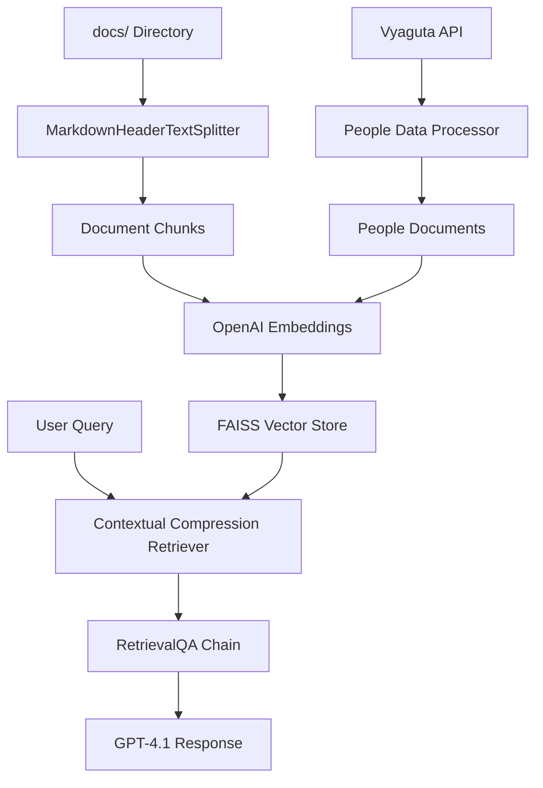

# Vyaguta Assistant Chatbot - Workflow Explanation

## Current Implementation Analysis

Based on your codebase analysis, here's the detailed breakdown of where each component from your proposal is actually implemented:

---

## 1. Data Sources Implementation

### ✅ **Currently Implemented:**

#### **Local Document Sources (docs/ directory)**

- **Location**: `docs/` folder containing markdown files
- **Files**:
  - `finance-perks-reimbursement.md`
  - `go-to-person.md`
  - `growth-assessment-program-gap.md`
  - `holiday-leave.md`
  - `onboarding-faq.md`
  - `org-structure.md`
  - `promotions.md`
  - `pulse.md`
  - `roles_and_policies.md`
  - `tools-knowledge-center.md`
  - `vyaguta-coding-guidelines.md`

#### **Vyaguta API Integration**

- **File**: `people.py`
- **API Endpoint**: `https://vyaguta.lftechnology.com/api/core/users`
- **Implementation**: `fetch_people_data()` function
- **Data Retrieved**: Employee information (firstName, lastName, email, department, designation, etc.)
- **Authentication**: Bearer token from `VYAGUTA_ACCESS_TOKEN` environment variable

### 🔄 **Partially Implemented:**

#### **Confluence Integration**

- **File**: `confluence_fetch.py`
- **Status**: Script exists but is separate from main workflow
- **Functionality**: Can fetch Confluence pages and convert to markdown
- **Output Directory**: `docs-confluence/` (currently empty in your workspace)
- **Integration Gap**: Not connected to the main RAG pipeline in `main.py`

---

## 2. Vector Database & Embeddings Implementation

### ✅ **Currently Implemented:**

#### **Vector Store**

- **Technology**: FAISS (Facebook AI Similarity Search)
- **Location**: `main.py` lines 17, 107
- **Implementation**:

```python
from langchain_community.vectorstores import FAISS
vectorstore = FAISS.from_documents(docs, embeddings)
```

#### **Embeddings**

- **Technology**: OpenAI Embeddings (Ada-002)
- **Location**: `main.py` line 18, 106
- **Implementation**:

```python
from langchain_openai import OpenAIEmbeddings
embeddings = OpenAIEmbeddings()
```

#### **Document Processing**

- **Chunking Strategy**: Markdown header-based splitting
- **Location**: `main.py` lines 44-75
- **Implementation**:

```python
from langchain.text_splitter import MarkdownHeaderTextSplitter
splitter = MarkdownHeaderTextSplitter(
    headers_to_split_on=[
        ("#", "Header 1"),
        ("##", "Header 2"),
        ("###", "Header 3"),
        ("####", "Header 4"),
    ]
)
```

#### **Metadata & Source Info**

- **Document Metadata**: Automatically preserved by LangChain Document objects
- **People Data Metadata**: Converted to Document format in `people.py`
- **Source Tracking**: Each document chunk maintains source file information

---

## 3. Retrieval-Augmented Generation (RAG) Implementation

### ✅ **Currently Implemented:**

#### **Hybrid Retriever**

- **Location**: `main.py` lines 86-116
- **Technology**: Contextual Compression + Embeddings Filter
- **Implementation**:

```python
from langchain.retrievers import ContextualCompressionRetriever
from langchain.retrievers.document_compressors import EmbeddingsFilter

compressor = EmbeddingsFilter(embeddings=embeddings, similarity_threshold=0.3)
hybrid_retriever = ContextualCompressionRetriever(
    base_compressor=compressor,
    base_retriever=base_retriever
)
```

#### **QA Chain**

- **Location**: `main.py` lines 175-188
- **Technology**: LangChain RetrievalQA
- **Implementation**:

```python
from langchain.chains import RetrievalQA
qa_chain = RetrievalQA.from_chain_type(
    llm=llm,
    retriever=retriever,
    chain_type="stuff",
    chain_type_kwargs={"prompt": prompt}
)
```

---

## 4. Large Language Model (LLM) Implementation

### ✅ **Currently Implemented:**

#### **LLM Configuration**

- **Location**: `main.py` lines 158-173
- **Model**: GPT-4.1-nano (OpenAI)
- **Implementation**:

```python
from langchain_openai import ChatOpenAI
llm = ChatOpenAI(
    openai_api_key=api_key,
    temperature=0.2,
    model="gpt-4.1-nano"
)
```

#### **Prompt Engineering**

- **Location**: `main.py` lines 118-156
- **Custom Template**: Detailed prompt for Vyaguta-specific responses
- **Features**: Context-aware, step-by-step instructions, fallback handling

---

## 5. Data Pipeline Workflow

### **Current Data Flow:**



### **Actual Implementation Details:**

1. **Document Loading** (`main.py` lines 44-75):

   - Loads from `docs/` and `docs-confluence/` directories
   - Uses `UnstructuredMarkdownLoader` for each file
   - Splits by markdown headers for fine-grained chunks

2. **People Data Integration** (`main.py` lines 78-82):

   - Fetches live data from Vyaguta API
   - Converts to LangChain Document format
   - Adds to main document collection

3. **Vector Store Creation** (`main.py` lines 104-116):

   - Creates FAISS index from all documents
   - Uses OpenAI embeddings for semantic search
   - Implements compression filtering for better retrieval

4. **Query Processing** (`main.py` lines 344-450):
   - Handles specialized queries (promotions, people) with dedicated logic
   - Falls back to RAG pipeline for general questions
   - Includes AI fallback for general knowledge

---

## 6. Missing Components (From Proposal vs Implementation)

### ❌ **Not Yet Implemented:**

#### **PostgreSQL with pgvector**

- **Current**: Using FAISS (in-memory)
- **Proposed**: PostgreSQL with pgvector extension
- **Gap**: No persistent vector storage

#### **Confluence Integration in Main Pipeline**

- **Current**: Separate script (`confluence_fetch.py`)
- **Proposed**: Integrated in main RAG workflow
- **Gap**: Manual step required to fetch Confluence data

#### **Real-time Vyaguta API Integration**

- **Current**: Only people data API
- **Proposed**: System status, permissions, announcements
- **Gap**: Limited API coverage

#### **Scheduled Data Synchronization**

- **Current**: Manual refresh required
- **Proposed**: Automated daily/hourly sync
- **Gap**: No automated pipeline

---

## 7. Recommendations for Alignment

### **Immediate Actions:**

1. **Integrate Confluence Loader**:

   ```python
   # Add to main.py load_onboarding_docs()
   if os.path.exists("docs-confluence"):
       directories.append("docs-confluence")
   ```

2. **Add PostgreSQL Support**:

   - Install `psycopg2` and `pgvector`
   - Replace FAISS with PostgreSQL vector store
   - Implement persistent storage schema

3. **Expand Vyaguta API Integration**:

   - Add system status endpoints
   - Implement user permission checking
   - Create real-time data refresh

4. **Automate Data Pipeline**:
   - Schedule Confluence fetching
   - Implement change detection
   - Add error handling and logging

### **Architecture Evolution Path:**

```
Current (FAISS + Local Files)
    ↓
Add Confluence Integration
    ↓
Migrate to PostgreSQL + pgvector
    ↓
Implement Automated Sync Pipeline
    ↓
Add Real-time Vyaguta API Features
```

---

## Summary

Your current implementation already has the core RAG components working:

- ✅ Vector embeddings with OpenAI
- ✅ FAISS vector store for similarity search
- ✅ LangChain orchestration
- ✅ Hybrid retrieval with compression
- ✅ Custom prompt engineering
- ✅ People data from Vyaguta API

**Next Steps**: Connect Confluence integration, migrate to PostgreSQL, and add automated synchronization to match your proposal specifications.

---

## 8. TODO: Implementation Roadmap

Based on the workflow diagram from your proposal, here are the detailed TODO items to complete the implementation:

### 🔴 **HIGH PRIORITY - Core Workflow Gaps**

#### **TODO 1: Integrate Confluence Data Source into Main Pipeline**

**Current State**: Confluence fetcher exists as separate script
**Required**: Direct integration into main RAG workflow

**Implementation Steps**:

```python
# In main.py - modify load_onboarding_docs() function
def load_onboarding_docs(directories=None):
    if directories is None:
        directories = ["docs", "docs-confluence"]

    # Add automatic Confluence fetching
    if should_refresh_confluence():
        from confluence_fetch import fetch_confluence_data
        fetch_confluence_data()

    # Existing document loading logic...
```

**Files to Modify**:

- `main.py`: Update `load_onboarding_docs()` function (lines 44-75)
- `confluence_fetch.py`: Convert to importable module
- Add environment variables for Confluence auto-sync

**Expected Outcome**: Confluence documents automatically available in RAG without manual script execution

---

#### **TODO 2: Replace FAISS with PostgreSQL + pgvector**

**Current State**: Using in-memory FAISS vector store
**Required**: Persistent PostgreSQL database with vector search

**Implementation Steps**:

1. **Database Setup**:

```sql
-- Create database and enable pgvector
CREATE EXTENSION IF NOT EXISTS vector;

-- Create documents table (matching proposal schema)
CREATE TABLE document_chunks (
    id SERIAL PRIMARY KEY,
    content TEXT NOT NULL,
    embedding vector(1536),
    source_type VARCHAR(50), -- 'confluence', 'vyaguta_api', 'local_docs'
    source_url TEXT,
    source_title TEXT,
    chunk_index INTEGER,
    last_updated TIMESTAMP DEFAULT NOW(),
    metadata JSONB
);

-- Create vector similarity index
CREATE INDEX ON document_chunks USING ivfflat (embedding vector_cosine_ops);
```

2. **Code Implementation**:

```python
# Replace in main.py
from langchain_community.vectorstores import PGVector

def create_retriever(docs):
    embeddings = OpenAIEmbeddings()

    # Replace FAISS with PostgreSQL
    CONNECTION_STRING = os.getenv("POSTGRES_CONNECTION_STRING")
    vectorstore = PGVector(
        collection_name="vyaguta_docs",
        connection_string=CONNECTION_STRING,
        embedding_function=embeddings,
    )

    # Add documents to vector store
    vectorstore.add_documents(docs)

    # Rest of retriever logic...
```

**Files to Modify**:

- `main.py`: Replace FAISS with PGVector (lines 104-116)
- `requirements.txt`: Add `psycopg2-binary`, `pgvector`
- `.env`: Add PostgreSQL connection string

**Expected Outcome**: Persistent vector storage matching proposal architecture

---

#### **TODO 3: Implement Metadata & Source Info Tracking**

**Current State**: Basic metadata from LangChain Document objects
**Required**: Comprehensive source tracking as shown in workflow diagram

**Implementation Steps**:

```python
# Enhanced document processing with detailed metadata
def process_document_with_metadata(file_path, content, source_type):
    return Document(
        page_content=content,
        metadata={
            "source_type": source_type,  # 'confluence', 'vyaguta_api', 'local_docs'
            "source_url": file_path,
            "source_title": extract_title(content),
            "last_updated": datetime.now().isoformat(),
            "file_size": len(content),
            "chunk_index": 0,  # Will be updated during chunking
            "department": extract_department_from_path(file_path),
            "content_type": detect_content_type(content)
        }
    )
```

**Files to Modify**:

- `main.py`: Enhance document processing (lines 44-75)
- `people.py`: Add metadata to people documents
- `confluence_fetch.py`: Add Confluence-specific metadata

**Expected Outcome**: Rich metadata for each document chunk enabling filtered searches

---

### 🟡 **MEDIUM PRIORITY - Enhanced Features**

#### **TODO 4: Expand Vyaguta API Integration**

**Current State**: Only people data API
**Required**: System status, permissions, announcements as per workflow

**Implementation Steps**:

```python
# New file: vyaguta_api.py
class VyagutaAPIClient:
    def __init__(self, base_url, token):
        self.base_url = base_url
        self.token = token

    def get_system_status(self):
        """Fetch current system status and maintenance schedules"""
        pass

    def get_user_permissions(self, user_id):
        """Get user-specific module access permissions"""
        pass

    def get_announcements(self):
        """Fetch recent system announcements"""
        pass

    def get_module_configs(self):
        """Get current module configurations"""
        pass
```

**API Endpoints to Research**:

- System status: `/api/system/status`
- User permissions: `/api/users/{id}/permissions`
- Announcements: `/api/announcements`
- Module configs: `/api/modules/config`

**Files to Create/Modify**:

- Create `vyaguta_api.py`
- Modify `main.py` to integrate additional API data
- Update `.env` with additional API endpoints

**Expected Outcome**: Real-time system data matching workflow diagram

---

#### **TODO 5: Implement Automated Data Synchronization**

**Current State**: Manual refresh required
**Required**: Scheduled background sync as mentioned in proposal

**Implementation Steps**:

```python
# New file: sync_scheduler.py
import schedule
import time
from datetime import datetime

def sync_confluence_data():
    """Daily Confluence sync"""
    print(f"[{datetime.now()}] Starting Confluence sync...")
    # Implementation

def sync_vyaguta_data():
    """Hourly Vyaguta API sync"""
    print(f"[{datetime.now()}] Starting Vyaguta API sync...")
    # Implementation

# Schedule jobs
schedule.every().day.at("02:00").do(sync_confluence_data)
schedule.every().hour.do(sync_vyaguta_data)

if __name__ == "__main__":
    while True:
        schedule.run_pending()
        time.sleep(60)
```

**Files to Create**:

- `sync_scheduler.py`: Background sync daemon
- `sync_manager.py`: Sync coordination logic
- Update `requirements.txt`: Add `schedule`

**Expected Outcome**: Automated data refresh without manual intervention

---

#### **TODO 6: Enhanced Context Retrieval with Filtering**

**Current State**: Basic similarity search
**Required**: Metadata-aware filtering as shown in workflow

**Implementation Steps**:

```python
# Enhanced retrieval with metadata filtering
def create_filtered_retriever(docs, filter_criteria=None):
    embeddings = OpenAIEmbeddings()
    vectorstore = PGVector(...)

    # Add metadata filters
    if filter_criteria:
        # Filter by source type
        if filter_criteria.get("source_type"):
            vectorstore = vectorstore.filter(
                metadata={"source_type": filter_criteria["source_type"]}
            )

        # Filter by date range
        if filter_criteria.get("date_range"):
            vectorstore = vectorstore.filter(
                metadata={"last_updated": {"$gte": filter_criteria["date_range"]}}
            )

    # Rest of retriever logic...
```

**Files to Modify**:

- `main.py`: Add filtering capabilities to retriever
- Add query preprocessing to detect filter needs

**Expected Outcome**: Context-aware document retrieval

---

### 🟢 **LOW PRIORITY - Optimization & Monitoring**

#### **TODO 7: Implement Query Preprocessing & Routing**

**Current State**: All queries go through same pipeline
**Required**: Smart routing based on query type

**Implementation Steps**:

```python
def preprocess_query(question: str):
    """Analyze query and determine optimal processing path"""

    # Detect query type
    if is_people_query(question):
        return {"type": "people", "filter": {"source_type": "vyaguta_api"}}
    elif is_policy_query(question):
        return {"type": "policy", "filter": {"source_type": "confluence"}}
    elif is_system_query(question):
        return {"type": "system", "filter": {"source_type": "vyaguta_api"}}

    return {"type": "general", "filter": None}
```

**Files to Modify**:

- `main.py`: Add query preprocessing before RAG
- Create query classification logic

---

#### **TODO 8: Add Vector Database Monitoring & Health Checks**

**Current State**: No monitoring of vector store health
**Required**: Database monitoring as enterprise requirement

**Implementation Steps**:

```python
# New file: db_health.py
def check_vector_db_health():
    """Monitor PostgreSQL vector database health"""
    # Check connection
    # Verify vector index performance
    # Monitor storage usage
    # Check embedding consistency
    pass

def log_retrieval_metrics(query, results, response_time):
    """Log RAG performance metrics"""
    pass
```

**Files to Create**:

- `db_health.py`: Database monitoring
- `metrics.py`: Performance tracking

---

### 📋 **Implementation Priority Order**

1. **Week 1**: TODO 1 (Confluence Integration) + TODO 3 (Metadata)
2. **Week 2**: TODO 2 (PostgreSQL Migration)
3. **Week 3**: TODO 4 (Vyaguta API Expansion)
4. **Week 4**: TODO 5 (Automated Sync) + TODO 6 (Enhanced Retrieval)
5. **Week 5**: TODO 7 & 8 (Optimization & Monitoring)

### 🎯 **Success Criteria**

After completing these TODOs, your implementation will fully match the workflow diagram:

- ✅ Confluence data flows automatically into vector database
- ✅ Vyaguta APIs provide real-time system data
- ✅ PostgreSQL stores persistent vector embeddings with metadata
- ✅ Context retrieval uses metadata for smart filtering
- ✅ Automated sync keeps data current
- ✅ Monitoring ensures system health

This will align your codebase perfectly with the proposal architecture!
