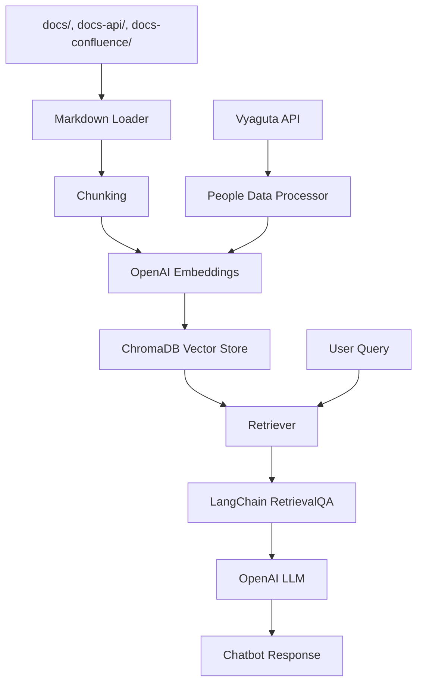
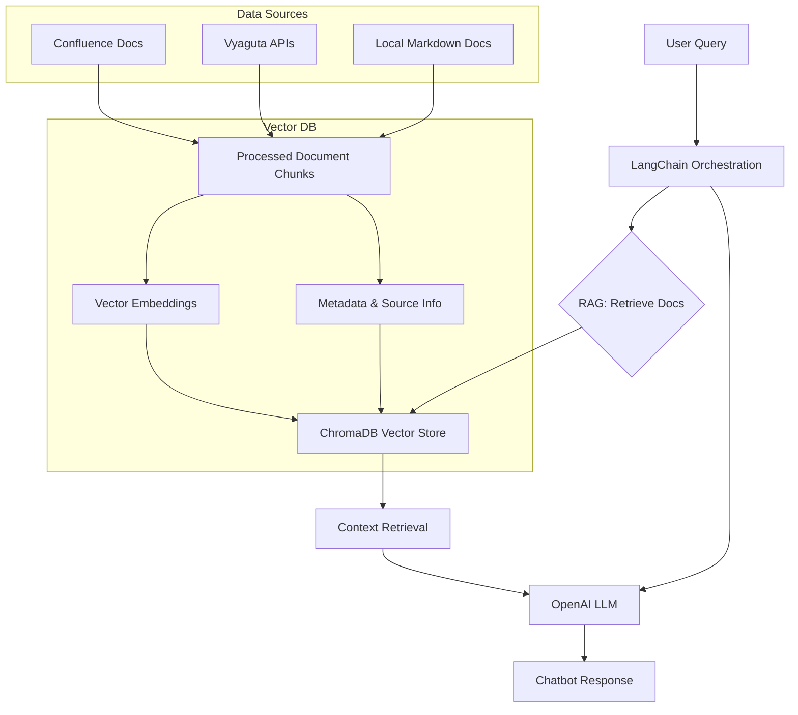

def create_retriever(docs):
def sync_confluence_data():
def sync_vyaguta_data():
schedule.every().hour.do(sync_vyaguta_data)
def check_vector_db_health():
def log_retrieval_metrics(query, results, response_time):
# Vyaguta Assistant Chatbot - Workflow Explanation (Updated July 2025)

## Overview

Vyaguta Assistant is a Retrieval-Augmented Generation (RAG) chatbot for Leapfrog Technology, designed to provide instant, context-aware answers about Vyaguta modules, onboarding, policies, and more. The system leverages LangChain, OpenAI LLMs, and a ChromaDB vector store for fast, accurate, and maintainable knowledge retrieval.

---

## 1. Data Sources Implementation

### ✅ **Currently Implemented:**

- **Local Markdown Docs:**
  - Directory: `docs/` (policies, onboarding, guidelines)
  - Also supports: `docs-api/`, `docs-confluence/` (Confluence docs fetched via script)
- **Vyaguta API Integration:**
  - File: `people.py`, `fetch_and_store_people_data.py`
  - Endpoint: `https://vyaguta.lftechnology.com/api/core/users`
  - Data: Employee info (name, email, department, etc.)
  - Auth: Bearer token from environment
- **Confluence Docs:**
  - Fetched via `confluence_fetch.py` and stored in `docs-confluence/`
  - Not yet fully automated, but can be included in the pipeline

---

## 2. Document Processing & Embeddings

- **Loader:**
  - Uses `UnstructuredMarkdownLoader` (LangChain) for all markdown files
- **Chunking:**
  - Uses `RecursiveCharacterTextSplitter` for robust, context-preserving chunking
  - Chunk size and overlap are configurable (see `rag_pipeline.py`)
- **Embeddings:**
  - OpenAI Embeddings (Ada-002) for all document chunks
- **Metadata:**
  - Each chunk stores source, file path, and additional metadata for traceability

---

## 3. Vector Store (ChromaDB)

- **Technology:** ChromaDB (persistent vector database)
- **Location:** `chroma_db/` directory
- **Management:**
  - All document chunks and embeddings are stored in ChromaDB
  - Fast semantic search and retrieval
  - Managed via `rag_pipeline.py` (see `build_chroma_vectorstore`)

---

## 4. Retrieval-Augmented Generation (RAG) Pipeline

- **Pipeline Entrypoint:** `setup_rag_pipeline()` in `rag_pipeline.py`
- **Retriever:**
  - ChromaDB retriever with top-k semantic search
  - Returns most relevant document chunks for a query
- **QA Chain:**
  - Built using LangChain's `RetrievalQA` chain
  - Combines retriever output with a custom prompt for the LLM
- **Prompt Engineering:**
  - Custom prompt template in `main.py` (see `get_prompt_template()`)
  - Handles special cases (e.g., people queries, fallback, creator info)

---

## 5. Large Language Model (LLM)

- **Model:** OpenAI GPT-4.1-nano (via `langchain_openai.ChatOpenAI`)
- **Temperature:** 0.2 (for factual, concise answers)
- **Usage:**
  - Generates answers using both the user query and retrieved context
  - Fallback logic: If context is insufficient, can use LLM general knowledge (with safeguards)

---

## 6. Data Pipeline Workflow

### **Current Data Flow:**

---

## 7. Automation & Index Management

- **Index Rebuild:**
  - Run `python rebuild_rag_pipeline.py` to rebuild the ChromaDB index and pickle when docs change
  - Fast startup: `main.py` loads existing index for instant use
- **Inspection:**
  - Run `python inspect_chromadb.py` to audit stored chunks and metadata
- **Streamlit UI:**
  - Run `streamlit run chatbot_gui.py` for a modern web interface

---

## 8. Query Processing & Fallbacks

- **Primary Path:**
  - User query → Retriever → QA Chain → LLM → Response
- **Fallbacks:**
  - If answer is not found in context, the assistant:
    - Shows the most relevant context chunk
    - Optionally uses LLM general knowledge (with strict prompt to avoid hallucination)
    - Always provides source info for transparency
- **Special Cases:**
  - People queries ("Who is Purna?") use a hardcoded, exact answer if required
  - Creator queries and promotion-year logic are handled in the prompt

---

## 9. Metadata & Source Tracking

- **Each chunk/document includes:**
  - Source type (local, API, Confluence)
  - File path or API endpoint
  - Title, chunk index, and last updated timestamp
  - Used for filtering, debugging, and traceability

---

## 10. Monitoring, Health, and Future Enhancements

- **Current:**
  - Logging via `log_utils.py`
  - Manual index rebuild and Confluence fetch
- **Planned/Recommended:**
  - Automated Confluence sync and data refresh (see roadmap in guides)
  - PostgreSQL + pgvector for enterprise-grade vector storage
  - More real-time API integrations (system status, permissions, announcements)
  - Query classification and smart routing
  - Health checks and performance monitoring
  - User feedback loop for answer quality

---

## 11. Summary Table: Key Scripts & Their Roles

| Script/File                | Role                                                      |
|---------------------------|-----------------------------------------------------------|
| `main.py`                 | Chatbot entrypoint, loads RAG pipeline, runs chat loop    |
| `rag_pipeline.py`         | Loads, chunks, embeds docs, manages ChromaDB vector store |
| `rebuild_rag_pipeline.py` | Rebuilds the RAG index and pickle                         |
| `inspect_chromadb.py`     | Inspects ChromaDB vector store for debugging              |
| `chatbot_gui.py`          | Streamlit web UI for the chatbot                          |
| `confluence_fetch.py`     | Fetches Confluence docs to markdown                       |
| `people.py`               | Fetches and processes Vyaguta people data                 |
| `log_utils.py`            | Logging utilities                                         |
| `config.py`               | Central config (doc directories, etc.)                    |

---

## 12. Visual Workflow (2025)

---

## 13. Roadmap & Next Steps

- **Automate Confluence and API sync** (background jobs)
- **Migrate to PostgreSQL + pgvector** for scalable, persistent vector storage
- **Expand API coverage** (system status, permissions, announcements)
- **Add query classification and smart routing**
- **Implement health checks and monitoring**
- **Collect user feedback for continuous improvement**

---

_Last updated: July 2025 — reflects current codebase and workflow. For more, see `/guides/rag_pipeline_workflow.md` and `/README.md`._
