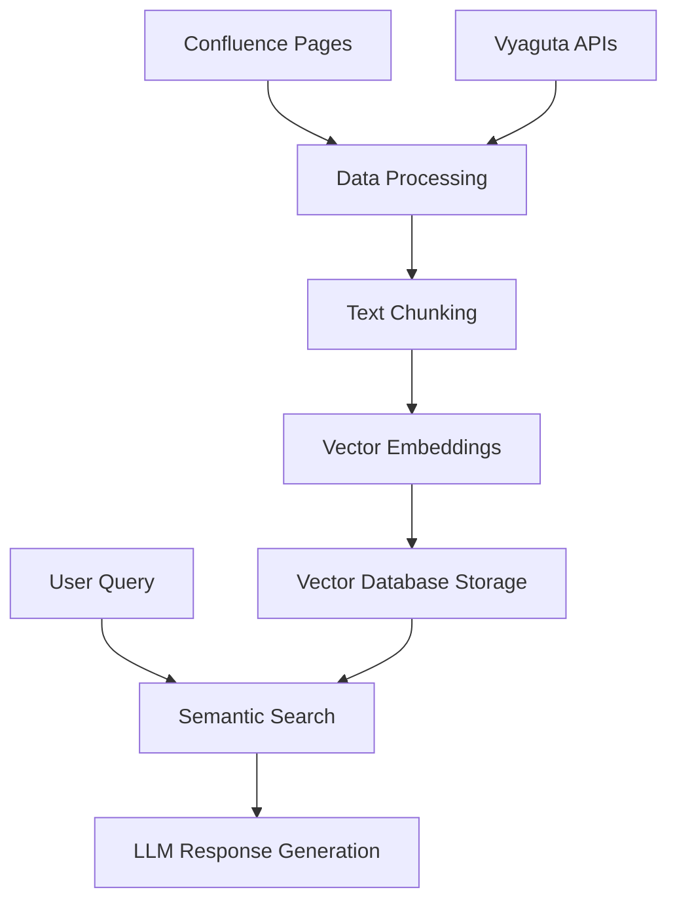

# Vyaguta Onboarding Assistant Chatbot Proposal

## Overview

This project is an AI-powered onboarding assistant chatbot for Vyaguta, Leapfrog Technology’s **Enterprise Resource Planning (ERP)** system. Vyaguta is used to manage day-to-day business activities such as **Employee Management, Project Management, Resource Management, Evaluation, and Employee Appreciation**. As a business management software, Vyaguta collects, stores, manages, and interprets data from organizational activities. The chatbot will help new hires and users quickly understand Vyaguta’s modules (**Core, Teams, Attendance, Jump, Honor, OKR, Pulse** & many more) and procedures by answering natural language questions. The goal is to streamline onboarding, reduce support overhead, and make information easily accessible.

## Problem Statement

Vyaguta is a comprehensive and complex platform with many modules and features. New hires and even existing employees often struggle to find information about how to use specific modules or complete common tasks. This leads to a steep learning curve, increased onboarding time, and frequent support requests. Without an easy way to access guidance, productivity and user satisfaction are negatively impacted.

## Solution

The solution is a chatbot that leverages **prompt engineering**, **Retrieval-Augmented Generation (RAG)**, and **LangChain** to answer user questions about Vyaguta. Users can ask questions like **“How do I request leave?”**, **“What is OKR?”**, or **“How does Pulse work?”** and receive clear, concise answers. The chatbot will:

- Use **prompt engineering** to handle common queries and guide user interactions.
- Employ **LangChain** and **RAG** to retrieve relevant information from internal documentation, onboarding guides, and FAQs.
- Be easily extensible to cover new modules or procedures as Vyaguta evolves.

This assistant will significantly reduce onboarding time, empower users to self-serve, and free up HR and support resources for higher-value tasks.

---

## Architecture & Workflow

The Vyaguta Onboarding Assistant Chatbot uses a sophisticated combination of modern AI technologies to provide intelligent, context-aware responses to user queries about Vyaguta's ERP system.

### Core Components:

- **LLM (Large Language Model):** For natural language understanding and response generation.
- **RAG (Retrieval-Augmented Generation):** To fetch relevant information from internal documentation.
- **LangChain:** To orchestrate the workflow between user queries, retrieval, and LLM responses.

**Enhanced Workflow Diagram:**

```mermaid
flowchart TD
    A[User Query] --> B[LangChain Orchestration]
    B --> C{RAG: Retrieve Relevant Docs}

    subgraph "Data Sources"
        D[Confluence Docs]
        E[Vyaguta APIs]
    end

    subgraph "Vector Database"
        H[Processed Document Chunks]
        I[Vector Embeddings]
        J[Metadata & Source Info]
    end

    D --> H
    E --> H
    H --> I

    C --> I
    I --> K[Context Retrieval]
    K --> L[LLM (OpenAI/GPT)]
    L --> M[Chatbot Response]
    B --> L
```

### Detailed Workflow Explanation:

1. **User Query Processing**: When a user asks a question like "How do I request leave in Vyaguta?", the system begins processing.

2. **LangChain Orchestration**: Acts as the central coordinator, managing the flow between different components and deciding whether to retrieve additional context or directly use the LLM.

3. **RAG Document Retrieval**: The system searches through relevant documentation to find the most appropriate context for the user's question.

4. **LLM Response Generation**: Using the retrieved context and the original query, the LLM generates a comprehensive, accurate response.

5. **Final Response Delivery**: The chatbot presents the answer in a user-friendly format.

---

## Technical Explanation

### Key Technical Components:

#### **1. Large Language Model (LLM)**

- **Definition**: A deep learning model trained on vast amounts of text data to understand and generate human-like text
- **Role**: Processes natural language queries and generates contextually appropriate responses
- **Implementation**: OpenAI GPT models accessed via API
- **Technical Details**:
  - Handles complex natural language understanding (NLU)
  - Generates coherent, context-aware responses
  - Maintains conversation context across multiple interactions

**Example**: When a user asks "What's the difference between OKR and KPI?", the LLM processes the natural language, understands the comparative nature of the question, and generates a structured explanation.

#### **2. Retrieval-Augmented Generation (RAG)**

- **Definition**: A technique that combines information retrieval with text generation to provide more accurate, factual responses
- **Role**: Fetches relevant documentation snippets before generating responses
- **Implementation**: Vector embeddings for semantic search + traditional keyword matching
- **Technical Details**:
  - Documents are converted to vector embeddings
  - User queries are embedded and compared against document vectors
  - Most relevant documents are retrieved and passed to the LLM
  - Reduces hallucination by grounding responses in actual documentation

**Example**: When asked about "leave policies", RAG searches through HR documents, finds relevant policy sections, and provides this context to the LLM for accurate response generation.

#### **3. LangChain Framework**

- **Definition**: A framework for developing applications with LLMs by chaining together different components
- **Role**: Orchestrates the entire workflow from query processing to response generation
- **Implementation**: Python-based framework with modular components
- **Technical Details**:
  - Manages prompt templates and response formatting
  - Handles memory and conversation context
  - Integrates various tools and data sources
  - Provides error handling and fallback mechanisms

**Example**: LangChain manages the flow: User query → Document retrieval → Context injection → LLM call → Response formatting → User delivery.

#### **4. Vector Database & Semantic Search**

- **Definition**: Database optimized for storing and querying high-dimensional vectors
- **Role**: Enables fast, semantic similarity searches across documentation
- **Implementation**: PostgreSQL with pgvector extension or dedicated vector databases
- **Technical Details**:
  - Documents chunked into smaller segments
  - Each chunk converted to vector embeddings
  - Cosine similarity for finding relevant content
  - Hybrid search combining semantic and keyword matching

---

## Non-Technical Explanation

### How It Works in Simple Terms:

#### **1. Smart Reading Assistant (LLM)**

Think of this as a highly intelligent assistant who has read thousands of books and can understand and explain complex topics in simple language. When you ask a question, it understands what you're really asking for and provides helpful answers.

**Real-world analogy**: Like having a knowledgeable colleague who can explain any Vyaguta feature in a way that makes sense to you.

**Example**: You ask "How do I check my attendance?" and the assistant understands you want step-by-step instructions for accessing attendance records in Vyaguta.

#### **2. Smart Search System (RAG)**

This is like having a super-fast librarian who can instantly find the exact page in any manual that answers your question. Instead of you having to search through hundreds of pages, it finds the relevant information in seconds.

**Real-world analogy**: Like having a personal research assistant who knows exactly where to find any information about Vyaguta procedures.

**Example**: When you ask about "expense reimbursement", the system quickly finds the relevant policy documents and procedure guides, then uses this information to give you accurate instructions.

#### **3. Workflow Coordinator (LangChain)**

This acts like a project manager who ensures everything works smoothly together. It decides when to search for information, how to combine different pieces of information, and how to present the final answer.

**Real-world analogy**: Like having a personal assistant who coordinates between different departments to get you the complete answer you need.

**Example**: When you ask a complex question like "What's the process for requesting vacation and how does it affect my OKR goals?", the coordinator ensures the system finds information about both vacation policies and OKR procedures, then combines them into one comprehensive answer.

### User Experience Examples:

#### **Scenario 1: New Employee Onboarding**

- **User**: "I'm new here. How do I set up my Vyaguta profile?"
- **System Process**:
  1. Understands this is an onboarding question
  2. Searches for profile setup documentation
  3. Generates step-by-step instructions
- **Response**: Detailed walkthrough with screenshots and tips

#### **Scenario 2: Complex Policy Question**

- **User**: "What happens to my accumulated leave when I change teams?"
- **System Process**:
  1. Searches HR policies and team transfer procedures
  2. Finds relevant policy sections
  3. Combines information from multiple sources
- **Response**: Clear explanation of leave transfer policies with specific examples

#### **Scenario 3: Feature Discovery**

- **User**: "I heard about something called Pulse. What is it?"
- **System Process**:
  1. Identifies this as a feature explanation request
  2. Retrieves Pulse module documentation
  3. Generates user-friendly explanation
- **Response**: Overview of Pulse features with practical use cases

[Edit or view this diagram online](https://mermaid.live/)

---

## Tech Stacks Used

### **Core Technologies:**

- **Web Development:** Full Stack (Frontend + Backend)
- **AI Integration:** OpenAI API (REST)
- **Framework:** LangChain for AI workflow orchestration
- **Database:** PostgreSQL with pgvector extension for vector storage

### **Data Sources & Integration:**

- **Confluence API:** For organizational documentation and knowledge base
- **Vyaguta REST APIs:** For real-time system data and user permissions

### **Data Processing:**

- **Vector Embeddings:** OpenAI Ada-002 embedding model
- **Document Processing:** Python libraries (BeautifulSoup, pandas, numpy)
- **Text Chunking:** LangChain text splitters and document loaders
- **Confluence Loader:** Custom Confluence document extraction

### **Infrastructure & Deployment:**

- **Vector Database:** PostgreSQL with pgvector for semantic search
- **Caching:** Redis for frequently accessed data
- **API Gateway:** For secure external API access
- **Monitoring:** Logging and analytics for system performance

### **Development Tools:**

- **Documentation:** Mermaid for diagrams, Markdown for documentation
- **Version Control:** Git for code management
- **Testing:** Automated testing for data pipeline and API endpoints
- **CI/CD:** Automated deployment and data synchronization pipelines

---

## Data Sources & Collection Strategy

The Vyaguta Onboarding Assistant will collect data from two primary sources to provide accurate and up-to-date information about Vyaguta modules and organizational procedures.

### Primary Data Sources:

#### **1. Confluence Documentation**

- **Source**: Company's Confluence workspace containing organizational knowledge
- **Content**: HR policies, Vyaguta user guides, department workflows, FAQ documents, onboarding processes
- **Access**: Confluence REST API with secure authentication
- **Update**: Daily automated synchronization

#### **2. Vyaguta API Integration**

- **Source**: Direct integration with Vyaguta's internal APIs
- **Content**: Real-time system status, user permissions, module configurations, system announcements
- **Access**: Vyaguta REST APIs with proper authentication
- **Update**: Real-time for critical information, hourly for general updates

### Data Pipeline Architecture:



---

## Data Processing & Storage Pipeline

### Data Processing Workflow:

#### **1. Data Extraction**

- **Confluence**: Extract documentation using Confluence Loader API
- **Vyaguta**: Fetch real-time data through REST APIs
- **Processing**: Convert to clean text and extract metadata

#### **2. Vector Database Storage**

- **Chunking**: Split documents into 500-1000 token chunks with overlap
- **Embeddings**: Generate vector embeddings using OpenAI Ada-002
- **Storage**: PostgreSQL with pgvector extension for semantic search

```sql
CREATE TABLE document_chunks (
    id SERIAL PRIMARY KEY,
    content TEXT NOT NULL,
    embedding vector(1536),
    source_type VARCHAR(50), -- 'confluence' or 'vyaguta_api'
    source_url TEXT,
    last_updated TIMESTAMP
);
```

#### **3. Data Synchronization**

- **Automated Pipeline**: Daily sync from Confluence, real-time from Vyaguta APIs
- **Quality Assurance**: Automated validation and duplicate detection

---

## Data Security & Compliance

### Security Measures:

- **API Authentication**: Secure token-based authentication for Confluence and Vyaguta APIs
- **Data Encryption**: All data encrypted in transit (HTTPS/TLS) and at rest
- **Access Control**: Role-based access based on user permissions
- **Audit Trails**: Logging of all data access and modifications

### Data Governance:

- **Source Verification**: Ensure data comes from authorized Confluence spaces and Vyaguta APIs
- **Content Validation**: Automated checks for data accuracy and completeness
- **Update Protocols**: Standardized procedures for data synchronization
- **Privacy Protection**: Careful handling of sensitive organizational information

---
